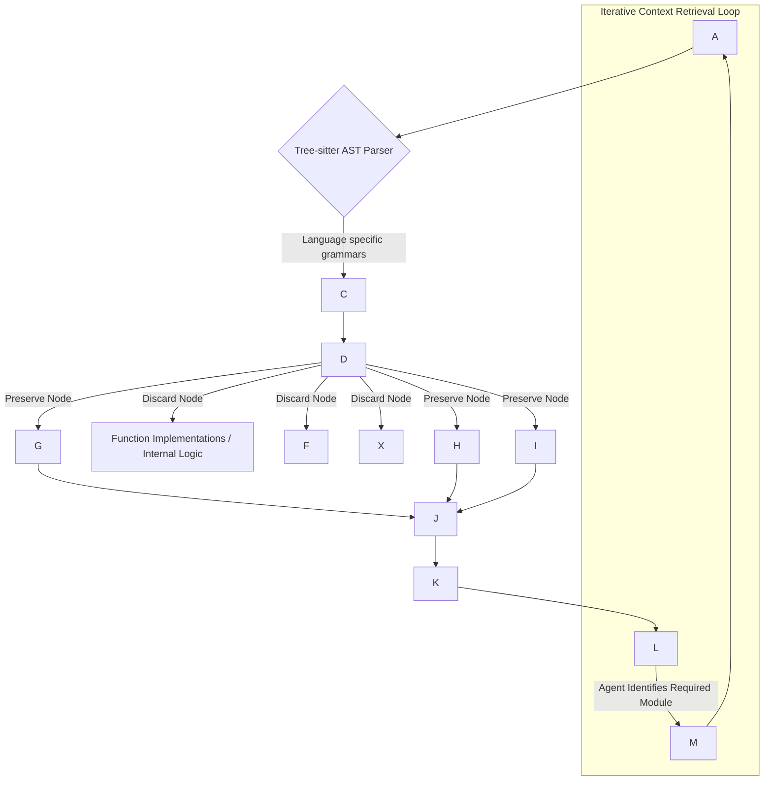

# Comprehensive Guide to Context Engineering Optimization for Cursor and Autonomous Coding Agents

The paradigm of software development is undergoing a profound structural shift driven by the integration of Large Language Models (LLMs) into the integrated development environment (IDE). The transition from rudimentary code completion tools to autonomous, agentic systems capable of orchestrating complex repository-wide refactoring necessitates a fundamental evolution in how these systems process information. This evolution is encapsulated in the discipline of context engineering. Unlike prompt engineering, which focuses on the semantic phrasing of instructions to elicit specific responses, context engineering is the systematic, algorithmic curation, structuring, and provisioning of external data to an LLM to ground its reasoning within a specific, localized environment.

For coding agents, this localized environment is the codebase—a highly structured, interconnected, and logically deterministic graph of files, functions, dependencies, and execution states. The core challenge in context engineering for coding agents lies in the inherent limitations of transformer-based architectures. While context windows have expanded substantially, processing hundreds of thousands of tokens introduces severe latency, high computational costs, and the well-documented attention degradation phenomenon, where models fail to retrieve relevant facts buried within massive context payloads. Furthermore, code is not akin to natural language prose; it is a rigid, mathematical structure where a single hallucinated variable name or misunderstood type signature renders the entire output mathematically and functionally invalid.

Consequently, feeding raw source code into a prompt via simple string concatenation or rudimentary vector similarity search is profoundly inadequate. Contemporary research dictates that optimal context engineering requires a multi-modal approach combining deterministic structural extraction, stateful memory management, dynamic context pruning, and robust human-in-the-loop authorization architectures. This comprehensive presentation guide provides an exhaustive, peer-level analysis of the most advanced methodologies in context engineering, derived from contemporary industry frameworks such as Ralph and Humanlayer. The objective is to dissect these methodologies theoretically and architecturally, providing detailed mathematical and structural breakdowns, followed by precise analyses of how these concepts can be practically applied to optimize internal coding workflows and sophisticated AI-first IDEs, with a specific focus on enhancing the capabilities of the Cursor IDE.

## Concept 1: Semantic Repository Mapping and Skeletal Extraction

## Concept Name & Definition

Semantic Repository Mapping and Skeletal Extraction is the algorithmic process of reducing a massive, unmanageable codebase into a dense, token-efficient architectural map. The concept is predicated on the theoretical understanding that an LLM reasoning engine does not require the underlying implementation details of every function to comprehend the global architecture of a software system. Instead, the model primarily requires the interfaces, type definitions, function signatures, class boundaries, and structural relationships between modules. This deterministic extraction methodology significantly mitigates token exhaustion and attention dilution while preserving the vital global semantic relationships necessary for an autonomous agent to navigate the project architecture accurately.

## Detailed Breakdown

The traditional approach to providing context to coding models involves utilizing vector databases to retrieve chunks of source code based on semantic similarity to the user's natural language query. However, vector search frequently fails in rigorous software engineering contexts because dense embeddings lack structural and syntactic awareness. A vector search might retrieve a structurally similar function from a completely irrelevant module while missing the critical interface definition required to utilize that function correctly in the current scope. Skeletal extraction, heavily utilized by tooling frameworks such as Ralph, abandons pure probabilistic statistical retrieval in favor of deterministic Abstract Syntax Tree (AST) parsing.

The underlying mechanism operates by processing the target repository through a highly optimized, language-aware parser. Industry-standard implementations typically utilize the Tree-sitter library, which provides incrementally parseable, concrete syntax trees for virtually all modern programming languages. The parser generates an AST for every source file within the project directory. Following the generation of the AST, a specialized traversal algorithm visits the nodes of the tree, applying strict, deterministic pruning heuristics.

Nodes representing function implementations, method bodies, variable assignments within local scopes, internal conditional logic, and iterative loops are excised from the representation. Conversely, nodes representing class declarations, interface definitions, exported types, function signatures, return types, decorators, and inter-module import statements are preserved. These preserved nodes are then formatted back into a syntactically valid, but heavily compressed, lightweight string representation.

The mathematical compression achieved by this structural extraction technique is substantial and critical for context window optimization. If $T_{full}$ represents the total token count of the raw, uncompressed repository and $T_{skeletal}$ represents the token count of the extracted architectural map, the compression ratio $C_R$ is defined as:

$$C_R = \frac{T_{full}}{T_{skeletal}}$$

Empirical data extracted from large-scale enterprise repositories suggests that for highly modular, object-oriented, or strictly typed codebases (such as TypeScript or Rust projects), the compression ratio $C_R$ can routinely exceed $10:1$, and in certain monolithic architectures, approach $20:1$. This efficiency effectively allows an autonomous coding agent to perceive the global architecture of a $200,000$-token repository utilizing fewer than $20,000$ tokens.

This skeletal map fundamentally serves as the foundational "worldview" for the agent. When the agent receives a directive, it first consults the highly compressed skeletal map to identify which specific modules, classes, or files contain the necessary implementation details related to the user's intent. It can then utilize secondary tool-calling capabilities to fetch the full implementation of only those highly specific, targeted components, effectively creating a hierarchical, multi-tiered retrieval system that drastically reduces overall token consumption and bypasses the transformer's inherent attention limitations.

To ensure robustness, the extraction process must be highly fault-tolerant. Autonomous coding agents frequently operate on codebases that are in an intermediate, logically broken state—such as during active development, mid-refactor, or when encountering compilation errors. Therefore, the underlying AST parser must possess robust error-recovery mechanisms. If the parser completely fails upon encountering a minor syntax error, the agent is blinded to the remainder of the file, leading to cascaded reasoning failures. Frameworks optimizing this approach utilize generalized parsing strategies that can gracefully skip broken tokens, isolate the syntactic error to a localized node, and resume valid tree construction at the subsequent valid statement boundary.

## Visual Diagram

Code snippet



## Practical Application

In the context of optimizing internal workflows within the Cursor IDE, skeletal extraction directly addresses the limitations of brute-force context inclusion mechanisms associated with repository-wide interactions. When a developer triggers an action that references the entire codebase—such as utilizing the `@Codebase` feature in Cursor's chat or relying on the Composer feature for multi-file generation—injecting the raw text of every retrieved file frequently leads to catastrophic attention dilution and latency spikes.

By implementing a background, asynchronous daemon within the Cursor client that continuously maintains an up-to-date skeletal map of the active workspace, the IDE can inject this architectural map into the system prompt invisibly. When a developer issues a complex, multi-system command, such as "Refactor the global authentication middleware to support JWT rotation and update all downstream consumer routes," the internal agent utilizes the pre-computed skeletal map to instantly locate the specific routing definitions, the current middleware interfaces, and the user model definitions without needing to execute a blind, probabilistic semantic search.

The Cursor agent can then utilize internal tool-calling to fetch the full text of only the `AuthMiddleware` class and the specific affected routes. This approach drastically reduces the Time-To-First-Token (TTFT) by minimizing the initial payload size. Furthermore, it severely curtails the likelihood of the underlying model hallucinating API parameters, internal variables, or object properties, as the exact, strictly-typed factual signatures of the entire repository are constantly present in its global memory state.

## Concept 2: Language Server Protocol Integration for Deterministic Context

## Concept Name & Definition

Language Server Protocol (LSP) Integration involves equipping an autonomous coding agent with the systemic ability to query standard IDE language servers dynamically. This integration allows the agent to resolve symbols, extract developer documentation, and map cross-file dependencies deterministically during its reasoning loop. Rather than guessing structural relationships or relying exclusively on probabilistic vector text matching, the agent interfaces directly with the exact same deterministic semantic engine that powers human-facing IDE features such as "Go to Definition," "Find All References," and real-time syntax error highlighting.

## Detailed Breakdown

The fundamental limitation of vector-based retrieval mechanisms in software engineering environments is their probabilistic nature. Code logic relies on absolute, deterministic relationships. A function invocation such as `user.save()` must be resolved to the exact `save` method within the specific `User` class scoped to that exact execution context. It cannot simply resolve to any function named `save` that appears semantically similar in the embedding vector space. The Language Server Protocol, an open standard originally developed by Microsoft to decouple language-specific semantic parsing from editor user interfaces, provides a standardized JSON-RPC based interface to query this exact semantic intelligence.

Advanced context engineering involves building a robust, bidirectional translation layer between the LLM's functional tool-calling capabilities and the active LSP server. When the agent is tasked with modifying a complex function, it does not passively rely on the initially provided context window. Instead, it actively invokes an LSP client. The interaction follows a strict, programmatic sequence. If the agent identifies an unknown symbol, custom type, or function call within its current scope, it emits a standardized JSON-RPC request over standard input/output streams to the language server.

Common, high-value requests include `textDocument/definition` (to locate the exact file and line number where a symbol is created), `textDocument/hover` (to extract the type signature and associated docstrings), and `textDocument/references` (to find everywhere a function is used before modifying its parameters). The language server, maintaining a fully resolved, strictly typed, abstract graph of the project in active memory, computes the exact location of the definition according to the language's compiler rules and returns the URI and range coordinates.

The agent's orchestration layer intercepts this JSON response, reads the corresponding text from the local file system using the provided coordinates, and dynamically injects the precise definition into the agent's context window. This creates a highly accurate, dynamic context gathering loop driven entirely by the agent's own cognitive demand rather than a pre-computed heuristic.

The mathematical advantage of LSP integration lies in the optimization of precision and recall metrics within the retrieval system. Let $P$ represent precision (the fraction of retrieved context snippets that are genuinely relevant) and $R$ represent recall (the fraction of relevant context snippets that are successfully retrieved). In standard vector RAG architectures applied to large codebases, $P$ is notoriously low due to variable name collisions, interface shadowing, and polymorphic method overloading. LSP integration drives the precision metric $P$ asymptotically close to $1.0$, as the language server definitively resolves the exact memory pointer of the symbol according to the language's strict scoping and inheritance rules.

|**Context Retrieval Methodology**|**Precision (P)**|**Structural Awareness**|**Computational/Latency Overhead**|**Primary Agent Use Case**|
|---|---|---|---|---|
|**Vector Similarity (Dense Embeddings)**|Low to Medium|None (Probabilistic/Statistical)|Low (Pre-computed index)|Broad conceptual queries, natural language documentation search.|
|**AST Skeletal Parsing (e.g., Ralph)**|High|High (Syntactic/Structural)|Medium (Background parsing)|Global architectural overview, interface mapping, global state.|
|**LSP Integration (JSON-RPC)**|Absolute (1.0)|Absolute (Semantic/Compiler-level)|High (Requires active server processes)|Precise symbol resolution, dependency tracing, exact refactoring.|

The primary engineering trade-off for LSP integration is latency and infrastructure complexity. Maintaining an active LSP server requires significant background computational memory, and querying it sequentially via JSON-RPC introduces inter-process communication overhead. Optimizing this pipeline requires intelligent batching of LSP requests and aggressive caching of deterministic responses to prevent redundant calculations during a single agentic execution thread.

## Visual Diagram

Code snippet

```
sequenceDiagram
    participant LLM as Coding Agent (LLM Core)
    participant Orchestrator as Context Engine (Tool Caller)
    participant LSP as Language Server (e.g., TSServer, Pyright)
    participant FS as Local File System
    
    LLM->>Orchestrator: Call Tool: get_symbol_definition("api/user_controller.ts", line 45, col 12)
    Orchestrator->>LSP: JSON-RPC Request: textDocument/definition
    Note right of LSP: Parses active AST, computes exact symbol reference based on TS scoping rules.
    LSP-->>Orchestrator: JSON Response: {"uri": "file:///models/user_entity.ts", "range": {"start": {"line": 10}, "end": {"line": 25}}}
    Orchestrator->>FS: Read file "models/user_entity.ts" at precise extracted range
    FS-->>Orchestrator: Returns precise class interface and docstring
    Orchestrator-->>LLM: Context Injected: "interface UserEntity { id: string; save(db: Database): Promise<boolean>; }"
    Note left of LLM: Agent continues reasoning iteration with mathematically exact, compiler-verified context.
```

## Practical Application

Integrating LSP-driven context gathering is central to transforming Cursor from a passive, text-prediction editor into an active, deterministic reasoning engine. Currently, developers utilize Cursor features like highlighting a block of code and pressing `Cmd+K` to "optimize this algorithm." A rudimentary implementation merely sends the highlighted text to the model. However, an advanced internal workflow utilizing LSP integration intercepts this request.

Before making the network call to the LLM, the internal orchestration layer parses the highlighted code snippet, extracts every external symbol, function call, and custom object type, and silently queries Cursor's internal language server (which is already actively running to support the human developer's syntax highlighting and error squiggles). The orchestrator then automatically builds a "semantic envelope" around the user's snippet, appending the precise compiler definitions of all referenced interfaces.

This mechanism completely eliminates the prevalent issue where the LLM generates theoretically sound logic that instantly fails to compile due to a minor type mismatch or an incorrect assumption about an imported function's parameter order. By guaranteeing that the underlying model possesses the exact identical semantic understanding of the codebase as the underlying compiler, the zero-shot acceptance rate of the generated code generated by Cursor's Composer or inline chat increases exponentially, fostering deeper developer trust.

## Concept 3: Human-in-the-Loop Architecture for Agentic Workflows

## Concept Name & Definition

Human-in-the-Loop (HITL) Architecture for Agentic Workflows is a fundamental structural framework designed to safely and predictably manage the transition from passive code-generation copilots to active, autonomous software agents capable of executing commands with systemic side effects. Frameworks such as Humanlayer provide sophisticated mechanisms to pause an agent's asynchronous execution thread, present a proposed action to a human operator for cryptographic, logical, or semantic authorization, and securely resume the thread upon approval. This architecture is absolutely essential for preventing destructive actions within the environment, such as executing unverified shell scripts, applying irreversible database migrations, or pushing unauthorized code modifications to production repositories.

## Detailed Breakdown

As context engineering improves and underlying foundation models achieve greater reasoning capabilities, agents become capable of highly complex, multi-step problem solving, naturally leading to the desire for total autonomy. However, unconstrained autonomy introduces severe security, operational, and infrastructural risks. The core software engineering challenge of HITL is not merely presenting a simple textual prompt to a user; it is rigorously managing the complex, asynchronous state of the LLM execution pipeline across distributed systems.

When an autonomous agent determines during its reasoning loop that it needs to run a mutating bash command (e.g., `npm install new-dependency && rm -rf./dist`), the system architecture must explicitly intercept this tool call before it reaches the execution sandbox or terminal. The architectural implementation requires a highly stateful orchestration layer. The standard linear execution of a transformer inference loop must be successfully suspended.

The context engine orchestrator serializes the current state of the agent's memory, the proposed tool call, the exact parameter payload, and the specific reasoning chain that led to the decision. This serialized state is placed into a persistent pending execution queue. The system then routes an authorization request to the appropriate human interface channel—this could be a dedicated terminal prompt within the IDE, an external web interface, or an asynchronous notification via enterprise communication tools like Slack or Microsoft Teams.

The latency introduced by human approval—which can range from seconds to days—requires extremely robust context lifecycle management. If a human approval takes several hours, the underlying codebase may have mutated significantly due to other developers pushing commits. Advanced HITL systems must implement validation checks upon resumption; if the target repository state has diverged beyond a predefined threshold since the thread was initially suspended, the system must either inject the newly calculated diff into the agent's context and ask it to re-evaluate its proposed action, or automatically invalidate the request entirely to prevent merge conflicts or logic errors.

Furthermore, HITL requires highly granular, Role-Based Access Control (RBAC) policy definition specifically tailored for agents. Requesting synchronous human approval for every file read operation is cognitively unmanageable and completely negates the efficiency of autonomy. Context engineering principles must be applied to define semantic and operational boundaries.

|**Operation Category**|**Agent Autonomy Level**|**HITL Architectural Requirement**|**Pipeline Execution State**|
|---|---|---|---|
|**Information Gathering** (Read file, grep text, AST parse, LSP query)|Fully Autonomous|None|Continuous / Uninterrupted|
|**Local Code Modification** (Write file buffer, inline refactor)|Semi-Autonomous|Post-execution review (Diff display)|Continuous, awaiting user accept/reject|
|**Local Environment Alteration** (Install dependencies, run test suites, format code)|Restricted|Synchronous User Prompt (IDE overlay)|Suspended until resolved|
|**External/Destructive Actions** (Deploy to cloud, DROP database, commit to `main`)|Blocked / Quarantined|Multi-factor / Asynchronous Cryptographic Approval|Suspended with timeout / Expiry|

## Visual Diagram

Code snippet

```
stateDiagram-v2
    [*] --> LLM_Reasoning: User Prompt or Background Task Received
    
    LLM_Reasoning --> ToolCall_Generation: Agent Decides on Action
    
    ToolCall_Generation --> PolicyEngine: Emit Proposed Action (e.g., Bash Command)
    
    state PolicyEngine {
        direction LR
        Evaluate --> Safe_Action: Read-Only / Within Boundary
        Evaluate --> Requires_Approval: Mutates State / Destructive
    }
    
    PolicyEngine --> ExecutionSandbox: If Evaluated as Safe_Action
    
    PolicyEngine --> ThreadSuspension: If Evaluated as Requires_Approval
    
    ThreadSuspension --> NotificationService: Serialize State & Dispatch Request (IDE UI/Slack)
    
    NotificationService --> HumanOperator: Display Proposed Action, Reasoning, and Impact
    
    HumanOperator --> WebhookReceiver: Human Input: Approve / Reject / Modify Command
    
    WebhookReceiver --> StateRehydration: Deserialization
    
    StateRehydration --> ExecutionSandbox: If Approved
    StateRehydration --> FeedbackLoop: If Rejected (Inject Human Rejection Note into Context)
    StateRehydration --> ModifiedExecution: If Modified by User
    
    FeedbackLoop --> LLM_Reasoning: Agent attempts alternative reasoning path
    
    ExecutionSandbox --> LLM_Reasoning: Return terminal standard output/error
    ModifiedExecution --> LLM_Reasoning: Return terminal output
    
    LLM_Reasoning --> [*]: Final Goal Accomplished
```

## Practical Application

In modern development environments, bridging the gap between a passive chat interface and an active, agentic terminal is the primary frontier of innovation. Applying Humanlayer-style HITL methodologies directly to Cursor means systematically replacing raw terminal execution access with a sophisticated semantic proxy layer. When a developer utilizes Cursor's terminal agent to "debug why the Vercel build is failing," the agent should possess the autonomy to run the build command, read the standard error output, analyze the stack trace, and propose code changes.

However, if the internal agent decides the ultimate solution requires upgrading a core framework dependency that might introduce breaking changes across the app, Cursor must natively intercept the `npm update` or `pip install` command. The IDE's interface should seamlessly transition into an elevated approval state. It should present the developer with the exact command to be run, a concise, LLM-generated summary of _why_ the agent believes the command is necessary based on the stack trace, and distinct "Approve", "Reject", or "Edit Command" UI buttons.

Crucially, if the developer clicks "Reject" and types "No, doing this will break the legacy payment module," the Cursor system injects the human's rejection reasoning directly back into the context window as a user message, forcing the agent to pivot and find an alternative solution that does not require dependency upgrades. This orchestration maximizes the agent's utility while maintaining strict, mathematically verified guardrails, preventing the common, catastrophic failure mode of an autonomous agent recursively breaking a local environment while attempting to fix a trivial bug.

## Concept 4: Multi-Tiered Retrieval-Augmented Generation for Codebases

## Concept Name & Definition

Multi-Tiered Retrieval-Augmented Generation (RAG) for codebases is a highly sophisticated architectural framework that transcends simplistic vector search by establishing a hierarchical, heterogeneous data retrieval ecosystem. It acknowledges the fundamental reality that software engineering requires vastly different typologies of context to answer different categories of developer queries. A multi-tiered system strategically integrates vector databases for semantic search, graph databases for relational topology and dependency tracking, and active file system parsing for real-time state, seamlessly orchestrating these disparate data sources into a unified, cohesive intelligence payload for the underlying model.

## Detailed Breakdown

The architectural complexity of modern enterprise monorepos dictates that no single, monolithic retrieval methodology is sufficient. A developer asking an agent "How do we handle user authentication conceptually?" requires conceptual documentation and semantic search across markdown files and comments. Conversely, a developer asking "What files will break if I change the parameter signature of `TokenValidator`?" requires strict topological dependency analysis, not semantic meaning. A multi-tiered RAG architecture uses a fast, preliminary query classification layer—often utilizing a smaller, low-latency LLM or a finely-tuned classifier—to intelligently route the user intent to the optimal retrieval engine.

**Tier 1: Semantic Layer (Vector Database / Dense Retrieval)**

Source code and documentation are chunked by functional block (functions, classes, paragraphs), embedded utilizing specialized code-aware embedding models designed to capture coding semantics, and stored in a high-dimensional vector database. This tier is primarily responsible for translating fuzzy, natural language queries into specific code locations. It is highly effective for exploratory queries, onboarding questions, and finding domain-specific terminology, but it is inherently prone to structural blindness.

**Tier 2: Topological Layer (Graph Database / AST Skeletal Map)**

The relationships between files, specific imports, functional inheritance structures, and interface implementations are extracted deterministically utilizing AST parsing (as detailed extensively in Concept 1) and stored as a directed graph. Nodes within this graph represent files, classes, or individual functions; directed edges represent logical dependencies, data flows, or execution calls. When an agent needs to comprehend the "blast radius" of a proposed code change, it queries the graph layer. Utilizing standard graph traversal algorithms (such as Breadth-First Search to isolate direct dependencies), the retrieval system can comprehensively extract all specific modules that consume a modified interface, directly injecting them into the context window.

**Tier 3: Ephemeral State Layer (LSP / Active Workspace Environment)**

This highly volatile tier represents the real-time, unsaved, and active state of the developer's local environment. It meticulously tracks open editor tabs, the user's current cursor position, recently executed terminal commands, active compiler errors, uncommitted Git modifications, and environment variables. While highly ephemeral, this data is profoundly relevant to resolving immediate, localized developer intent.

The architectural genius of multi-tiered RAG lies in the parallel synthesis of these specialized tiers. When a highly complex query is received, the orchestration agent breaks down the query into distinct sub-tasks and dispatches parallel requests to all three tiers simultaneously. The semantic layer finds the core definition file; the topological layer retrieves its interconnected downstream dependencies; the ephemeral layer checks if the developer currently has unsaved changes related to those exact files. The discrete results are subsequently synthesized, deduplicated, dynamically reranked (detailed in Concept 5), and formatted before being presented to the primary reasoning model. This provides the LLM with a dense, multi-dimensional understanding of the codebase that perfectly mirrors the cognitive problem-solving process of a human senior software engineer diagnosing a complex system architecture.

## Visual Diagram

Code snippet

```
flowchart TD
    User --> Classifier{LLM Query Intent & Routing Classifier}
    
    Classifier -->|Conceptual Search / Exploratory| Semantic
    Classifier -->|Structural Analysis / Blast Radius| Topology
    Classifier -->|Real-time Error Fixing / Active Context| State
    Classifier -->|Complex Multi-Step Orchestration| All
    
    All --> Semantic
    All --> Topology
    All --> State
    
    Semantic --> Synthesizer
    Topology --> Synthesizer
    State --> Synthesizer
    
    Synthesizer --> Reranker
    Reranker --> Formatter
    Formatter --> Agent
```

## Practical Application

To revolutionize internal coding workflows, implementing a multi-tiered RAG architecture enables truly intelligent, intent-aware codebase querying features. Current AI features in many IDEs often struggle with massive monorepos because they force every single interaction through a single vector search bottleneck, resulting in the retrieval of irrelevant files. By engineering Cursor's internal system to pre-compute both a local vector index and a local dependency graph in the background, the IDE can pull from a unified, incredibly powerful context server.

When a developer utilizes the Cursor Composer feature and asks, "Migrate all legacy logging endpoints to the new Datadog telemetry service," the system will not just blindly search for the word "telemetry." The intent classifier will parse the multi-step nature of the request. The system will utilize the Tier 1 Vector Search to find the documentation for the "new Datadog telemetry service," utilize the Tier 2 Graph Database to find all sixty files importing the "legacy logging endpoints," and use the Tier 3 State Layer to prioritize the three specific files currently open in the developer's editor tabs. This multidimensional context gathering guarantees that the Cursor agent operates with absolute architectural awareness, significantly increasing the probability of successful, zero-shot, repository-wide refactorings, distinguishing it entirely from less sophisticated coding assistants.

## Concept 5: Token Optimization, Dynamic Context Pruning, and Reranking

## Concept Name & Definition

Token Optimization and Dynamic Context Pruning is the rigorous algorithmic process of filtering, mathematically scoring, and compressing retrieved informational context before it is appended to the LLM's final prompt. Even though modern foundational models boast massive context windows—frequently exceeding 200,000 to 1,000,000 tokens—overwhelming the model with unstructured noise severely degrades its logical reasoning capabilities. Dynamic pruning relies on sophisticated cross-encoder reranking algorithms to ensure that the context window is exclusively populated by the absolute highest-value, mathematically relevant information. This methodology directly reduces operational inference latency, minimizes expensive API costs, and maximizes output fidelity.

## Detailed Breakdown

The data retrieval pipeline in an advanced context engine naturally retrieves far more information than is strictly necessary to solve a problem. A standard semantic search across a massive monorepo might return fifty code chunks that share some mathematical vector similarity with the user's query. Appending all fifty raw chunks directly to the prompt introduces the well-documented "needle in a haystack" problem. The self-attention mechanism of transformer models computes information quadratically—specifically, $O(N^2)$ in terms of time and memory complexity relative to the sequence length $N$. As the sequence grows excessively large, the attention weights distributed across the context dilute, causing the model to prioritize information localized at the very beginning and very end of the prompt while ignoring or hallucinating critical data situated in the middle.

To counteract this structural limitation, dynamic context pruning implements a highly optimized, multi-stage funnel architecture. The initial stage utilizes high-recall, low-precision retrieval known as hybrid search. This combines dense vector embeddings (which capture deep semantic meaning) with sparse keyword retrieval algorithms like BM25 (which capture exact matching variable names, unique identifiers, and specific syntax). The mathematical representation of hybrid scoring involves normalizing and linearly combining the respective scores:

$$\text{Score}_{hybrid} = \alpha \cdot \text{normalize}(\text{Score}_{dense}) + (1 - \alpha) \cdot \text{normalize}(\text{Score}_{sparse})$$

Where $\alpha$ represents a tunable hyperparameter dictating the balance between semantic meaning and exact match retrieval.

The critical second stage in the funnel is the integration of a Cross-Encoder Reranker. Unlike bi-encoders utilized in initial vector retrieval—which embed the query and the document entirely separately and compute a simple cosine similarity metric—cross-encoders feed both the exact query and the retrieved document chunk into a transformer simultaneously. This allows the model to compute rich, bidirectional attention between the specific tokens of the query and the specific tokens of the document, resulting in an exceptionally accurate relevance score.

The reranker scores the initially retrieved candidates and sorts them hierarchically. The pruning algorithm subsequently applies a strict token budget. It iterates down the newly ranked list, dynamically appending chunks to the final context payload until the mathematical token limit threshold is reached. Crucially, advanced pruning algorithms implemented in modern architectures also perform semantic deduplication and structural grouping; if disparate chunks extracted from the same source file are adjacent in the newly ranked list, they are seamlessly merged back into a continuous block to preserve structural and logical coherence, preventing the LLM from receiving fragmented, confusing snippets of isolated code.

Furthermore, intelligent summarization techniques are consistently applied to older contextual memory. In a long-running, iterative chat session, the agent's past conversational turns consume valuable prompt tokens. A background pruning system continuously monitors the conversational history; when it exceeds a predefined threshold, an asynchronous, low-parameter background LLM process compresses older conversational turns into a dense, bulleted summary. This guarantees that the agent retains the overarching narrative and constraints of the task without expending thousands of tokens re-reading verbatim transcripts of resolved steps.

## Visual Diagram

Code snippet

```
flowchart TD
    Q --> H
    
    subgraph Stage 1: High Recall Retrieval
    H -->|Dense Embeddings| V
    H -->|Sparse Exact Match| K
    V --> M
    K --> M
    M --> R_Init
    end
    
    subgraph Stage 2: High Precision Reranking
    R_Init --> C
    Q --> C
    C -->|Bidirectional Self-Attention Computation| S
    end
    
    subgraph Stage 3: Dynamic Pruning & Context Formatting
    S --> B{Token Budget Check}
    B -->|Under Token Limit| Merge[Merge Adjacent File Chunks]
    B -->|Over Token Limit| Discard
    Merge --> B
    Merge --> Final[Final Optimized Context Payload]
    end
    
    Final --> LLM[LLM Inference Engine API]
```

## Practical Application

In optimizing the architecture of the Cursor IDE, aggressive token optimization is the defining foundational factor in user perceived responsiveness, perceived intelligence, and backend cost-efficiency. When developers utilize Cursor features that index the entire codebase, sending massive, unfiltered prompts results in unacceptable generation times that disrupt the developer flow state, alongside astronomical API costs.

By implementing a localized, lightweight reranking model directly within the Cursor client architecture or edge network, the system can rapidly retrieve hundreds of candidate files from a local vector store instantly, rerank them in milliseconds, and construct a highly optimized, surgical prompt. This optimization specifically enables Cursor to implement dynamic, tiered context limits based on the capability of the specific model being utilized by the user.

For instance, if the developer routes a quick query to `claude-3-haiku` for a rapid autocomplete, Cursor aggressively prunes the context to only the top 3 reranked files to ensure instant execution. If the task is routed to `gpt-4o` or `claude-3.5-sonnet` for complex reasoning via Cursor Composer, the token budget is heavily expanded, but the rigorous reranking ensures that only the highest quality data occupies the expanded window. This methodology guarantees that the agent focuses entirely on the variables, functions, and files explicitly necessary to execute the code transformation, drastically reducing hallucination rates while keeping the application highly performant.

## Concept 6: Stateful Ephemeral Memory and Execution Feedback Loops

## Concept Name & Definition

Stateful Ephemeral Memory and Execution Feedback Loops refer to the systemic infrastructure required to support long-running, genuinely autonomous coding agents. Unlike simple stateless conversational chat interfaces that immediately forget the operational context once the API response is generated, advanced coding agents maintain a persistent, structured memory of their actions, successes, test failures, and environmental variables across multiple sessions and execution environments. This architecture enables the agent to iteratively learn from its localized mistakes during complex debugging sessions.

## Detailed Breakdown

To achieve genuine autonomy within a codebase, an agent must be capable of executing generated code, systematically observing the outcome, learning from compilation or runtime failures, and persisting that knowledge for the duration of the task. This requires transitioning from a passive, stateless API interaction model to an active, stateful, containerized execution model. When an agent is tasked with a massive goal (e.g., "Upgrade this Next.js project from version 13 to version 14 and fix all breaking changes across the routing layer"), the process may necessitate hundreds of iterative steps and span multiple hours of computation.

The foundational architecture heavily relies on a dedicated, isolated execution sandbox—typically a secure Docker container, a microVM (such as Firecracker), or a specialized environment like E2B—that perfectly mirrors the local developer's environment. The agent interacts with this environment via an orchestration layer that exposes standard programmatic interfaces: a virtual file system (for reading/writing), a virtual terminal (for executing shell commands), and a localized LSP client.

Memory management in this sophisticated stateful environment is functionally categorized into three distinct time horizons:

1. **Working Memory (Context Window):** The immediate, highly volatile prompt, containing the current file being actively edited, the most recent terminal output, and the specific step in the agent's current deterministic plan.
    
2. **Episodic Memory (Vector DB / Log Traversal):** A complete chronological record of all actions taken, bash commands run, and intermediate test results. When the agent encounters a new compiler error, it first queries its episodic memory: "Have I seen this exact error before during this task, and what did I do to attempt to fix it?" This fundamental loop prevents infinite recursive failures where an agent stubbornly tries the exact same failed solution.
    
3. **Semantic Memory (Knowledge Graph / Rules File):** Persistent, abstracted learnings about the specific codebase that transcend the current, immediate task. If the agent empirically learns that `legacy_build_script.sh` requires specific, undocumented environment variables to run successfully, it permanently stores this rule in its semantic memory. In future sessions, the context engine preemptively injects this rule whenever the agent attempts to run that script, entirely bypassing the failure loop.
    

The execution environment also provides critical, continuous feedback loops. If the agent modifies a file, the orchestrator automatically runs the relevant unit test suite, linter, or compiler in the sandbox. The raw standard output (stdout) and standard error (stderr) are captured. However, raw compiler output—especially in frameworks like React or Rust—can be massive and incredibly context-heavy, overwhelming the model. A vital secondary context engineering step is required here: an automated error-summarization model parses the raw stack trace, logically extracts the core failure, identifies the failing line of code, and feeds a concise, structured error report back into the agent's working memory, rather than dumping thousands of lines of terminal text.

## Practical Application

Integrating stateful execution environments and sophisticated feedback loops represents the ultimate evolutionary step for internal development tools and AI-first IDEs like Cursor. Currently, many developers utilize AI merely to generate code, after which they must manually copy it into their editor, manually run the test suite in their terminal, and manually feed the terminal errors back to the AI in a chat box. A stateful architecture automates this entire manual loop.

Cursor can optimize its workflows by providing internal agents with secure, ephemeral, cloud-based sandboxes equipped with full internal network access, or by utilizing secure local terminal execution via the IDE interface. When a developer triggers a complex task via Cursor Composer, the IDE hands off the execution loop. The agent operates within the HITL boundaries (Concept 3), utilizing skeletal extraction (Concept 1) and multi-tiered retrieval (Concept 4) to navigate the repository, automatically compiling code and running tests iteratively in the background. The agent stores its learnings in episodic memory. Once the task is finally completed and all tests pass cleanly in the sandbox, the orchestration layer packages the finalized, validated code diff and streams it back to the developer's local Cursor IDE for a final, streamlined human review. This fundamentally shifts the modern developer's role from writing syntactical code to reviewing, steering, and orchestrating autonomous, state-aware systems.

## Strategic Recommendations for Cursor System Optimization

Synthesizing these advanced context engineering methodologies yields highly actionable, concrete architectural paradigms for dramatically optimizing AI-first development environments. To maximize the utility of coding agents while mathematically minimizing computational overhead and cognitive load on the human user, Cursor's internal workflows and product architecture should deeply integrate the following strategies:

1. **Transition Fully to Deterministic Context Gathering:** Deprecate sole reliance on statistical vector search for local code retrieval. Implement deep LSP-driven orchestration layers that allow the Cursor agent to actively traverse the codebase deterministically. This guarantees that the agent's semantic understanding of the codebase is perfectly aligned with the compiler, drastically reducing syntactical hallucinations during multi-file generations.
    
2. **Implement Continuous Skeletal Mapping Architectures:** Integrate extremely lightweight AST parsers directly into the background processes of the Cursor client. Maintain a continuously updated, highly compressed skeletal map of the active project. This ensures that the global architecture is immediately available to the agent with minimal token expenditure, enabling instant context scaling without sacrificing Time-to-First-Token performance.
    
3. **Mandate Asynchronous Human-in-the-Loop Orchestration for Terminal Operations:** As internal agents are granted more autonomy via features like Cursor Terminal, strict structural boundaries must be enforced. Implement stateful execution managers capable of pausing the reasoning thread to seek human approval for destructive or state-mutating bash actions. The UI must present these authorization requests seamlessly, providing the human operator with clear, contextual summaries of the proposed action and its potential blast radius.
    
4. **Enforce Dynamic Token Budgeting via Edge Cross-Encoder Reranking:** Never stream raw retrieval results directly into the LLM prompt. Institute a mandatory, multi-stage reranking pipeline. Utilize dense and sparse hybrid retrieval for high recall, followed immediately by local, low-latency cross-encoder reranking. This ensures that only the most mathematically relevant contextual fragments occupy the critical context window, reducing hallucination.
    
5. **Develop Context-Aware Multi-Tiered Query Routing:** Acknowledge that different developer intents require fundamentally different data topologies. Implement rapid orchestration models that classify user queries within the Cursor chat and route them intelligently to the appropriate retrieval engine—vector stores for conceptual documentation queries, graph databases for structural dependencies, and active file system state for real-time debugging.
    

By rigorously migrating away from passive, probabilistic text retrieval and fully adopting active, deterministic, and stateful methodologies, developers can engineer AI systems that completely transcend simple autocomplete functionality. These optimized systems operate as genuine, capable autonomous peers, navigating complex enterprise monorepos, executing logically sound repository-wide refactorings, and accelerating the software development lifecycle with unprecedented accuracy and computational efficiency. The future of software engineering is fundamentally tied to the rigorous evolution of these context orchestration methodologies, transforming the IDE from a passive editor into an active, intelligent, and mathematically precise execution environment.